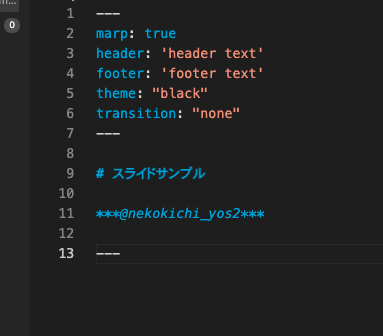

<!-- _backgroundColor: red -->
# スライドサンプル

***@nekokichi_yos2***

---

## プロフィール

 

- CatLuck2
- Swift,Java
- 3 iOS apps Release, join AppDojoSalon 

--- 

## 概要

1. 今日のLTでわかること
2. Swiftのコードをリファクタリング
3. 終わりに

--- 

## 終わりに

1. ありがとう
2. ございました。